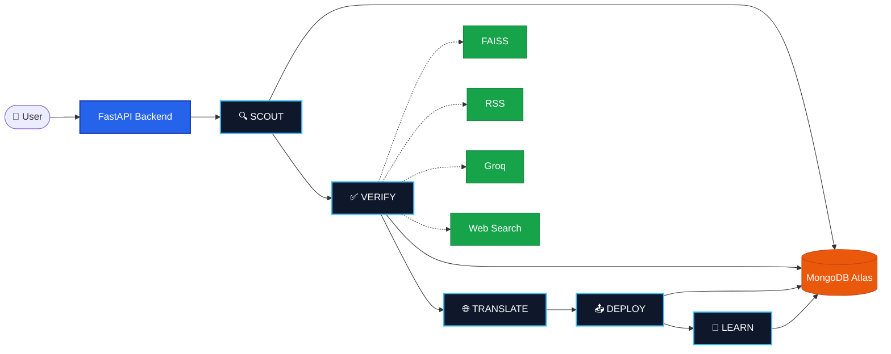

<div align="center">

# TruthSetu

**AI-powered multi-agent misinformation detection system for crisis communication**

Detects, verifies, translates, and responds to viral misinformation using trusted government sources, semantic retrieval, and multilingual AI.


</div>

---

## Overview

TruthSetu is a real-time AI fact-checking platform designed to combat crisis misinformation.

When a user forwards a viral claim (via WhatsApp or dashboard), TruthSetu:

- 🔍 Extracts the factual claim
- 📚 Verifies it using trusted government & fact-checking sources
- 🧠 Performs semantic retrieval with FAISS
- 🌐 Searches live web data when required
- 🌍 Translates responses into regional languages
- 📲 Delivers verified corrections back to the user

---

## Architecture



---

## Features

- Multi-agent AI workflow
- Semantic search using FAISS
- Real-time RSS monitoring
- Live web verification
- Multilingual responses
- WhatsApp integration
- Automated template learning
- React monitoring dashboard

---

## Tech Stack

| Backend | AI | Database | Frontend |
|---------|----|----------|----------|
| FastAPI | Groq Llama 3.1 | MongoDB Atlas | React + Vite |
| Python | Sentence Transformers | FAISS | CSS |
| APScheduler | Tool Calling | Motor | |

---

## Project Structure

```
backend/
 ├── agents/
 ├── api/
 ├── core/
 └── db/

frontend/
data/
```

---

## Workflow

```
Incoming Claim
      │
      ▼
Claim Extraction
      │
      ▼
Semantic Verification
      │
      ▼
Source Validation
      │
      ▼
Translation
      │
      ▼
WhatsApp Response
```

---

## Future Improvements

- Meta WhatsApp Business API
- IndicTrans2 Translation
- WebSocket dashboard
- Redis + Celery pipeline
- Telegram deployment
- ML-assisted verification

---

## Author

**Arnav Karmankar**

B.Tech CSE (AI & Analytics) • MIT ADT University

Building practical AI systems focused on intelligent automation, backend engineering, and applied machine learning.

---

## License

This project is proprietary and provided for **portfolio and evaluation purposes only**.

No permission is granted to copy, modify, redistribute, or use any part of this project without prior written permission from the author.

© 2026 Arnav Karmankar. All Rights Reserved.
